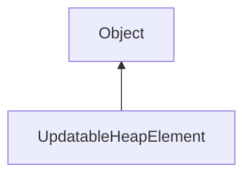

#### Inheritance Graph

## Functions

|
| --------------------------------------------------------------------------------------------------------------------------------------------------------: | -------------------------------------------- | 
| **[data](classUtil_1_1UpdatableHeap_1_1UpdatableHeapElement#classUtil_1_1UpdatableHeap_1_1UpdatableHeapElement_1a57ed17c0287226528652343e97120abc)**()    | [ESMF] Object UpdatableHeapElement.data()    | 
| **[getCost](classUtil_1_1UpdatableHeap_1_1UpdatableHeapElement#classUtil_1_1UpdatableHeap_1_1UpdatableHeapElement_1a66b003eb17b73004094b99b5f47fb5fd)**() | [ESMF] Object UpdatableHeapElement.getCost() | 
{: .nohead .nowrap1 }

