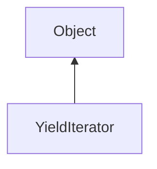

#### Inheritance Graph

## Functions

|
| ------------------------------------------------------------------------------------------------------------: | ---------------------------- | 
| **[end](classEScript_1_1YieldIterator#classEScript_1_1YieldIterator_1a8fbf645c12a97d225b94048b26c93547)**()   | bool YieldIterator.end()     | 
| **[key](classEScript_1_1YieldIterator#classEScript_1_1YieldIterator_1ad0395549cc139870f6a3b95a4a025115)**()   | Object YieldIterator.key()   | 
| **[next](classEScript_1_1YieldIterator#classEScript_1_1YieldIterator_1a6e323b03e5953fc9670f52a1fa6256b3)**()  | thisObj YieldIterator.next() | 
| **[value](classEScript_1_1YieldIterator#classEScript_1_1YieldIterator_1a70b98cd00053694b016f0b9e6ee6259e)**() | Object YieldIterator.value() | 
{: .nohead .nowrap1 }

