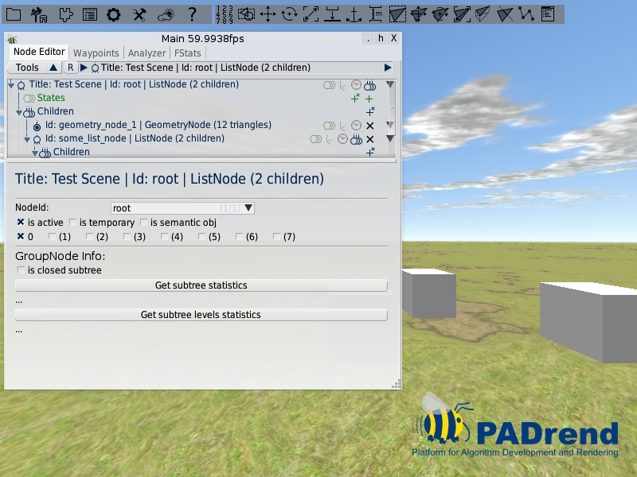

<!------------------------------------------------------------------------------------------------
This work is licensed under the Creative Commons Attribution-ShareAlike 4.0 International License.
 To view a copy of this license, visit http://creativecommons.org/licenses/by-sa/4.0/.
 Author: Florian Pieper (fpieper@mail.uni-paderborn.de)
 PADrend Version 1.0.0
------------------------------------------------------------------------------------------------->

## Goal of this tutorial
This tutorial is about PADrend's scene graph.
You will learn to create a simple scene graph and register it to PADrend, so that it is displayed as active scene.

## Creating a simple scene graph
Lets create a scene graph made of five nodes.
This is only a structural example of a scene graph.
To fill the graph with geometry, some cubes are created.
It is not important to understand the mesh creation, since it will be the main topic of another tutorial.

<!---INCLUDE src=SceneCreation.escript, start=14, end=24--->
<!---BEGINN_CODESECTION--->
<!---Automaticly generated section. Do not edit!!!--->
```js
//building nodes
var rootNode = new MinSG.ListNode();
var listNode = new MinSG.ListNode();

var mesh1 = Rendering.MeshBuilder.createBox(new Geometry.Box(-2, 0, 0, 1, 1, 1));
var mesh2 = Rendering.MeshBuilder.createBox(new Geometry.Box(2, 0, 0, 1, 1, 1));
var mesh3 = Rendering.MeshBuilder.createBox(new Geometry.Box(0, 0, -2, 1, 1, 1));

var geometryNode1 = new MinSG.GeometryNode(mesh1);
var geometryNode2 = new MinSG.GeometryNode(mesh2);
var geometryNode3 = new MinSG.GeometryNode(mesh3);
```
<!---END_CODESECTION--->

First we need to create the nodes themselves.
This is simply done by instantiating objects.
For our scene we need two objects of the class _MinSG.ListNode_ and three of the class _MinSG.GeometryNode_.
Next up we connect the nodes to a tree similar to the one in the image bellow.


The simplest way to attach a node to a list node is by using  _+=_ operator.
But you can also use the method _addChild_.
The graph is created by adding _listNode_ and one of the geometry nodes to the root node.
Afterwards the two other geometry nodes are connected to the list node.

<!---INCLUDE src=SceneCreation.escript, start=34, end=39--->
<!---BEGINN_CODESECTION--->
<!---Automaticly generated section. Do not edit!!!--->
```js
//Building the scene graph
rootNode.addChild(geometryNode1);
rootNode.addChild(listNode);

listNode += geometryNode2;
listNode += geometryNode3;
```
<!---END_CODESECTION--->

## Giving the nodes an id
We can provide a name(identifier) for each node.
This id's will show up in the _Node Editor_ and can help identifying specific nodes when the graph is traversed.

<!---INCLUDE src=SceneCreation.escript, start=26, end=32--->
<!---BEGINN_CODESECTION--->
<!---Automaticly generated section. Do not edit!!!--->
```js
//giving nodes a unique id
PADrend.getSceneManager().registerNode("root", rootNode);
PADrend.getSceneManager().registerNode("some_list_node", listNode);

PADrend.getSceneManager().registerNode("geometry_node_1", geometryNode1);
PADrend.getSceneManager().registerNode("geometry_node_2", geometryNode2);
PADrend.getSceneManager().registerNode("geometry_node_3", geometryNode3);
```
<!---END_CODESECTION--->

You can give an id to a node by calling PADrend.getSceneManager().registerNode(_ID_, _NODE_).

## Providing meta data
The last step of this tutorial is to register the scene graph to PADrend, which will treat it as a scene.
Before we do that lets attach some meta data to the scene.
This step is optional, however it can be important to provide this information (i.e. for license reasons).
The meta data fields that can be set are:

* Title: The title of the scene.
* Creation Date: When was the scene created?
* Author: Who created the scene?
* License: The license the scene is shipped with. Possible values are "free", "internal use" and "RESTRICTED".
* Note: Some information about the scene.

Before we can set the meta data we first need to load the module containing the necessary functions.

<!---INCLUDE src=SceneCreation.escript, start=42, end=42--->
<!---BEGINN_CODESECTION--->
<!---Automaticly generated section. Do not edit!!!--->
```js
var NodeMetaInfo = Std.module('LibMinSGExt/NodeMetaInfo');
```
<!---END_CODESECTION--->

For setting the current date, we first need to fetch it.

<!---INCLUDE src=SceneCreation.escript, start=43, end=43--->
<!---BEGINN_CODESECTION--->
<!---Automaticly generated section. Do not edit!!!--->
```js
var date = getDate();
```
<!---END_CODESECTION--->

For each field the class _NodeMetaInfo_ contains a function to access it.
Each of these functions returns a data wrapper that can be used to set or read the field.
The node which should contain the meta data is passed as parameter.
We want to attach the meta data to the root node of our scene (_rootNode_).

<!---INCLUDE src=SceneCreation.escript, start=45, end=49--->
<!---BEGINN_CODESECTION--->
<!---Automaticly generated section. Do not edit!!!--->
```js
NodeMetaInfo.accessMetaInfo_CreationDate(rootNode)("" + date["year"] + "-"+ date["mon"] + "-" + date["mday"] );
NodeMetaInfo.accessMetaInfo_Title(rootNode)("Test Scene");
NodeMetaInfo.accessMetaInfo_Author(rootNode)("Max Mustermann");
NodeMetaInfo.accessMetaInfo_License(rootNode)("free");
NodeMetaInfo.accessMetaInfo_Note(rootNode)("Some info about the scene.");
```
<!---END_CODESECTION--->

## Registering the scene to PADrend
Lets register the scene and tell PADrend to display it.
Therefore PADrend offers the two functions _registerScene_ and _selectScene_.
We simply call first register and then select and pass the root node of our scene graph to them.

<!---INCLUDE src=SceneCreation.escript, start=51, end=54--->
<!---BEGINN_CODESECTION--->
<!---Automaticly generated section. Do not edit!!!--->
```js
//Register the root node of the scene graph
PADrend.registerScene(rootNode);
//Selecting the root node to be the active scene
PADrend.selectScene(rootNode);
```
<!---END_CODESECTION--->

The scenes geometry will now be displayed.
You can use PADrend's _Main_-window to check the structure of the scene graph.




