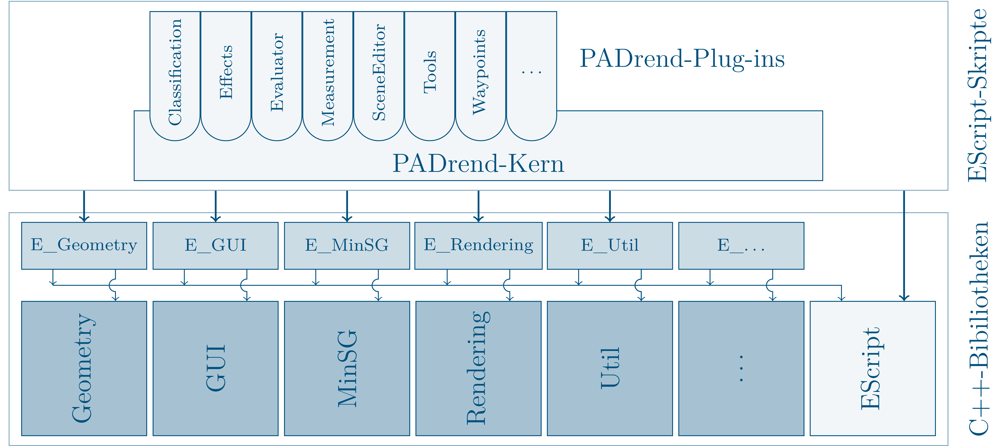

## PADrend
PADrend stands for **Platform for Algorithm Development and Rendering** – a software system for virtual walkthroughs through complex virtual three dimensional scenes.
PADrend is developed since 2007 in the research group [Algorithms and Complexity](https://www.hni.uni-paderborn.de/alg) at the Heinz Nixdorf Institute, Paderborn University.
The goals of PADrend are the harmonization of development efforts, the establishment of a basis to compare 3D rendering algorithms, and the provision of an adequate basis for research and teaching.
Among other things, PADrend is utilized to develop and evaluate new rendering algorithms, to support students in writing their bachelor's and master's theses, and to do design reviews of complex virtual scenes in the [HD visualization center](https://www.hni.uni-paderborn.de/en/service/rooms-of-building-f/hd-center-fu116/).

## PADrends internal structure

PADrend is a collection of utility libraries written in C++ which are tied together using an extensive plugin system written in [EScript](https://github.com/EScript/EScript), a powerful scripting language developed by one of the founding developers of PADrend.
The libraries provide various utility functions, data structures and algorithms that are commonly used in the context of real-time rendering and provides a high-level abstraction of the low-level rendering API (e.g., OpenGL).
The core logic of PADrend is based on a plug-in system written entirely in EScript
EScript allows for quick prototyping, configuration, and evaluation of rendering algorithms. 
For each of the C++ libraries, PADrend provides a wrapper library (starting with "E_") that exposes (almost) all functionality of the C++ libraries to EScript.
This allows for excessive control of the entire system using only EScript.

## Library Overview

In the following, we give a short overview of the core C++ libraries used by PADrend and what they are used for.

### Geometry
In computer graphics you often have to deal with vectors and transformation matrices. The Geometry library offers you classes for most of the geometry problems you may be faced with.

### GUI
Provides you with PADrend's graphical user interface framework.

### MinSG
Defines PADrend's scene graph. It also contains of the graphs nodes as well as states that enable single nodes or a group of nodes to be rendered in a specific way. Never mind if you are node familiar with scene graphs. There will be tutorials on it.

### Rendering
Handles everything that has something to do with rastering objects to the screen. It contains the wrapping of OpenGL, handeling textures, managing of meshes, the handling of shaders and a wrapper for OpenCL.

### Sound
Classes for basic sound output.

### Util
Here you find useful stuff like IO, networking, bitmaps and timers. Also you can find the actual window of the application here. A lot of platform depended functions are wrapped for you. In this way you can code platform independent.

## PADrends Livecycle
When you start the PADrend executable, first of all the EScript runtime and wrapper libraries are initialized.
This steps ensures that you can use PADrends C++ libraries in your EScript code.
Next up the execution environment reads the filename of the main-script from the command line, loads and executes it.
In the main-script first of all EScript Std library and PADrend's config file are loaded.
If you start PADrend for the first time, an empty config file will be created.
After that the script hands over the control to PADrend.escript.
There is a default location of PADrend.escript in the config file.
If you need to adapt it for some reason, there is the place where you can do so.
In the PADrend.escript script first of all the core plugins will be loaded.
Next up some global variables like the frame context and rendering context are created.
After that the PADrend plugin is loaded.  
So PADrend itself is a plugin.
As a plugin, it defines some extension points.
You will learn about extension points later on.
For now you just need to know that you can attach your own callback functions to them.
Whenever a extension get called, your callback function will be called.
In this way you get informed about events (for example the closing event of PADrend).
First of all plugin loads all plugins defined in the config file and then it calls the extension 'PADrend_Init'.
Then it loads the graphical user interface module.
After that the autorun script is executed.
By default there is none, but you can write one if you need it.
You need to enter its location in the config file.
At the end the extension 'PADrend_Start' is executed, which hands over the control to the event loop.

### The Event Loop
In the listing below you can see PADrend's event loop.

	while active:
		execute ’PADrend_BeforeRendering’
		for each rendering-pass:
			execute extension ’PADrend_BeforeRenderingPass’
			render the pass with containing scene and camera
			execute extension ’PADrend_AfterRenderingPass’
		execute extension ’PADrend_AfterRendering’
		handle planned tasks
		fetch events (mouse, keyboard, . . . )
			for each event execute ’PADrend_UIEvent’ (or ’PADrend_KeyPressed’).
		execute extensions ’PADrend_AfterFrame’
		swap buffer
	execute extension ’PADrend_Exit’

The first line in the loop creates the rendering-passes and prepares the system for rendering.
Then for each rendering pass the containing scene is rendered.
When the extension ’PADrend_AfterRendering’ executed, the GUI is drawn, as it registers its draw function to the extension.
After that all events are processed.
There is  one extension to ’PADrend_UIEvent’ handles the camera movement (’PADrend/Navigation’-plugin).
If you need some key handling in one of your projects, just register your own extension.
After that swap buffer is used to swap the window's front and back buffer.
When the loop is stopped, 'PADrend_Exit' will be called and PADrend shuts down.
