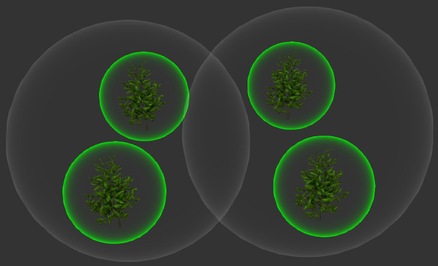
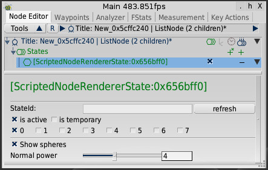

The goal of this exercise is to implement a simple rendering algorithm that modifies the default frustum culling.
You will learn how to implement a renderer using states and how to work with custom node attributes.
As a test scene, you can use the scene provided in the [Scene Loading and Navigation](scene_loading_and_navigation) tutorial.

> **Note**: This exercise can be solved purely in EScript. However, we recommend to use C++ to get better performance and make yourself familiar with the interaction between EScript and C++.

## Exercise 1: Creating a Binary Tree

Required Languages: | C++ or EScript | EScript |
{:.lang_label}

In the first exercise we want to modify the scene graph, such that we can use it more easily for the next exercises.
Rebuild the scene graph of the current scene into a binary tree using the following algorithm:

1. Rebuild the active scene into a list (see, e.g., [MinSG.TreeBuilder](escript_namespace_MinSG_TreeBuilder)).
2. Cluster the nodes in a binary tree using the following pseudo code:

```lua
function createBinaryTree(Node N)
  if node N has at most 2 children then
    return
  else
    let d be the larger of the x- and z-dimension of the bounding box of N
    split the children of N into two new list nodes L,R
      according to their median position along d
    createBinaryTree(L)
    createBinaryTree(R)
    add L and R to node N
    return
  end if
end function
```

> **Hint**: You can use [Rendering.calculateBoundingSphere](escript_group_Rendering_Meshes#meshutils) to compute the bound sphere of a single mesh.

## Exercise 2: Creating a Boundig Sphere Hierarchy

Required Languages: | C++ or EScript | EScript |
{:.lang_label}

We now want to create a bounding volume hierarchy based on spheres instead of bounding boxes.
This can be done by annotating each node in a scene graph with a custom attribute.
You can assume that the tree is a binary tree (computing bounding spheres for general trees is significantly harder).

Build a bounding sphere hierarchy using the following pseudo code:
```lua
function computeBoundingSpheres(Binary Tree N)
  let S be a sphere
  if node N is a geometry node then
    set S to be the minimum bounding sphere of the mesh of N
    transform S to the world coordinate system
  else
    let L and R be the left and right children of N
    S1 = computeBoundingSpheres(L)
    S2 = computeBoundingSpheres(R)
    set S to be the smallest sphere containing S1 and S2
  end if
  attach S to N as a node attribute
  return S
end function
```

> **Note**: You should also handle the case when a node has only a single child.

## Exercise 3: Frustum Culling with Spheres

Required Languages: | C++ or EScript | EScript |
{:.lang_label}

Based on the data structure created in the previous exercises, we will now create a simple renderer that modifies the default frustum culling of PADrend by using bounding spheres instead of bounding boxes.
For this, create a new `NodeRendererState` that only overrides the `displayNode` function.
In the `displayNode` function, first retrieve the bounding sphere from the current nodes attributes. 
Then, test the sphere against the active camera frustum by testing for each frustum plane on which side the sphere lies.
If the sphere is outside the frustum, the state should stop the traversal of the current nodes subtree.
Otherwise, it continues as usual.

If you are done, you can use a script or GUI entry to add the renderer state to the current scene.
To see the effect, you need to create a statistics window which shows the currently rendered nodes. 

> **Note**: You need to disable the default frustum culling in PADrend first (in the config menu under Rendering settings).

> **Note**: If you use C++, you also have to implement the required EScript wrapper classes.

## Exercise 4: Visualizing Bounding Spheres with Shaders

Required Languages: | C++ or EScript | GLSL |
{:.lang_label}

To better visualize the bounding sphere hierarchy created in the previous exercises, we now want to use a shader to draw colored spheres around the nodes.
Modify the `displayNode` function such that the bounding sphere of the current node is rendered after the frustum test was passed.
The sphere should be rendered using a shader that highlights the silhouette of the spheres by setting the alpha value of a rendered fragment based on its camera space normal.
You can use the following formula for this:

$$
\alpha = \left(1 - \left|\frac{\mathbf{n}}{\lVert \mathbf{n}\rVert} \cdot \frac{\mathbf{p}}{\lVert \mathbf{p}\rVert}\right|\right)^{x}
$$

where $$\mathbf{n}$$ is the camera space normal, $$\mathbf{p}$$ the camera space position, and $$x\geq0$$ a factor that influences the strength of the normal. 

> **Note** $$\frac{\mathbf{v}}{\lVert \mathbf{v}\rVert}$$ is the normalized vector of $$\mathbf{v}$$ and $$\cdot$$ is the dot product.

Use a uniform flag to draw leaf nodes (geometry nodes) in a different color than the inner nodes of the scene graph. 

You can load the shader in the constructor of the `NodeRendererState`.
To avoid creating a new mesh for each bounding sphere, create a mesh of a unit sphere in the constructor and use a transformation matrix to transform it to the correct position and setting its size (the easiest way to do this is to store the mesh in a `GeometryNode` and modifying its transformation before rendering).
When rendering the sphere, you should disable depth writing and back-face culling, and enable blending with source blend factor `SRC_ALPHA` and destination blend factor `ONE_MINUS_SRC_ALPHA`.

The visualization should look somewhat like the following:


> **Note**: The scene root does not show a sphere since `displayNode` gets only called on the children of node that the `NodeRendererState` is attached to.

## Exercise 5: Add a GUI to the Renderer

Required Languages: | EScript |
{:.lang_label}

Create a configuration GUI for the renderer with a checkbox for enabling the sphere visualization, and a slider that controls the influence of the sphere normal $$x$$.

> **Note**: You need to add a uniform variable to the shader to control the influence of the normal.

The GUI should look somewhat like the following:


## Exercise 6: Serialization

Required Languages: | C++ or EScript |
{:.lang_label}

Create serializers for your `NodeRendererState` to allow saving and loading of the scene together with the renderer state.
